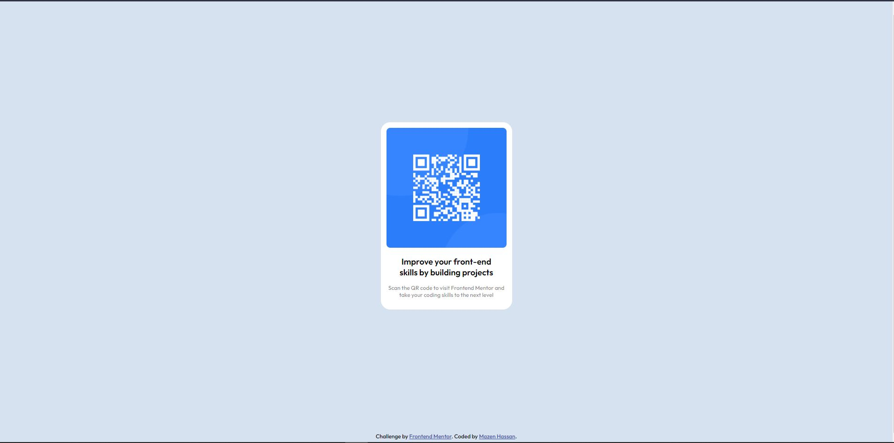

# Frontend Mentor - QR code component solution

This is a solution to the [QR code component challenge on Frontend Mentor](https://www.frontendmentor.io/challenges/qr-code-component-iux_sIO_H). Frontend Mentor challenges help you improve your coding skills by building realistic projects. 

## Table of contents

- [Overview](#overview)
  - [Screenshot](#screenshot)
  - [Links](#links)
- [My process](#my-process)
  - [Built with](#built-with)
  - [What I learned](#what-i-learned)
  - [Continued development](#continued-development)
  - [Useful resources](#useful-resources)
- [Acknowledgments](#acknowledgments)


## Overview

This is my first HTML CSS challenge by Frontend Mentor. in this challenge I had to constraint and center the QR code content in the middle of 

screen while making it responsive and flexible as well.

### Screenshot




### Links

- Solution URL: https://www.frontendmentor.io/solutions/responsive-qrcodecomponent-challenge-3nGa5fqqgI
- Live Site URL: https://mazz100.github.io/QR-code-component/#

## My process

* I started out by modifying my HTML and adding <div> elements and both a header <h2> and paragragh <p> for the provided text.
* Created css stylesheet and linked it inside of HTML. 
* Used the body element to start adding display type and fonts(size-weight-family) and the background color of website.
* Later on I removed my container <div> and replaced it with <main> element, included the main content of webpage. Added the <footer> element for the links <a>. 


### Built with

- Semantic HTML5 Markup
- CSS custom properties
- Visual Studio Code.


### What I learned

Use this section to recap over some of your major learnings while working through this project. Writing these out and providing code samples of areas you want to highlight is a great way to reinforce your own knowledge.


```HTML
  <p>I learned a new element <main> and its very important to give a clear idea where is the main content of the page located.</p>

  <main>
    

    <h2>
      Improve your front-end skills by building projects
    </h2>

    <p>
      Scan the QR code to visit Frontend Mentor and take your coding skills to the next level
    </p>
  </main>

  <p>I thought that just installing google-fonts and installing it is all its to simply use it inside of CSS but I was wrong. It was simply 
  
  copying the font link and linking it without the need to download.</p>

  <!-- Linking to a google font with selected family-->
  <link rel="preconnect" href="https://fonts.googleapis.com">
  <link rel="preconnect" href="https://fonts.gstatic.com" crossorigin>
  <link href="https://fonts.googleapis.com/css2?family=Outfit:wght@400;500;600&display=swap" rel="stylesheet">

```

```CSS
/* In this part of the body I learned how to center the content in webpage but I still didn't fully understand the concept, align-item and justify-content looked confusing to me and how they are used together but with other elements it made more sense to me and hopefully in future projects it will click for me  */
body {
    display: flex;
    align-items: center;
    justify-content: center;
    flex-direction: column;
    min-height: 100vh;
}

/* I much liked this one and learned the new rem element and how important it is for scalability and flexibility it provides for users, I also used it for font size and it made more sense as to how it response to the default fonts of browsers. */
main {
    background-color: white;

    padding: 12px;
    border-radius: 20px;
    
    max-width: 16rem;
    margin: auto
}

```


### Continued development

In my future projects I want to reflect on my mistakes and use best practice codes to have a good looking websites and a clean reusable code as well as useful for different purposes and serve every user needs.

**Note: Delete this note and the content within this section and replace with your own plans for continued development.**

### Useful resources

- [Importing font into HTML/CSS](https://www.w3docs.com/snippets/css/how-to-import-google-fonts-in-css-file.html#:~:text=Open%20Google%20Fonts%20and%20follow,(in%20HTML%20or%20CSS).) - This helped me for how to import a custom font, I used the HTML method and next time I may try the CSS one, otherwise its a great source.


## Acknowledgments

A great thanks for Discord community for taking their time to assist me with clear and detailed answers. Truly grateful! <3.

